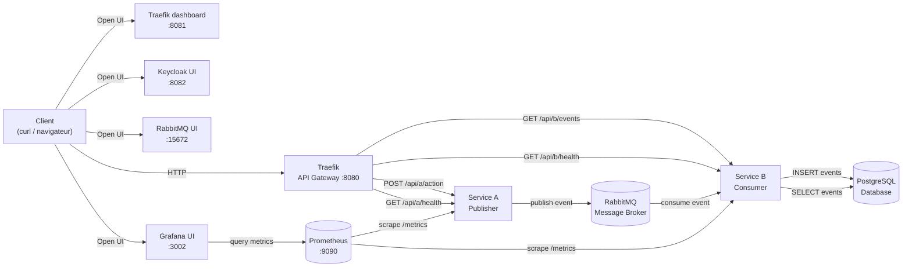

# Mini projet de référence – Module 321  
**Programmer des systèmes distribués**

## 1. Objectif du projet
Ce projet est un **POC local** servant de référence pour le module **321 – Programmer des systèmes distribués**.

Il illustre une **architecture distribuée standardisée** utilisée par tous les projets du module, avec :
- une **API Gateway**
- un **service d’identité**
- plusieurs **services métier**
- un **message broker**
- un **stockage persistant**
- des **health checks** et un **status global** qui sont monitoré par prometheus
- grafana pour monitorer et alerter en cas de problème

Le projet est entièrement lançable en local via **Docker Compose**.



---

## 2. Architecture globale
**Composants principaux :**
- API Gateway : **Traefik**
- Service d’identité : **Keycloak**
- Service métier 1 : *publisher*
- Service métier 2 : *consumer*
- Message broker : **RabbitMQ**
- Base de données : **PostgreSQL**
- Monitoring avec prometheus
- Reporting avec grafana

**Règles d’architecture :**
- Un **point d’entrée unique** via l’API Gateway
- Chaque service expose `/health /ready /health /metrics /info`
- Communication asynchrone via RabbitMQ
- Tous les services sont lancés ensemble avec Docker Compose

---

## 3. Prérequis
- Docker ≥ 24
- Docker Compose v2
- Aucun outil supplémentaire requis

---

## 4. Lancement du projet

### 4.1 Démarrage
```bash
docker compose up --build
```

⏳ Le premier démarrage peut prendre quelques minutes (téléchargement des images et initialisation de Keycloak).

### 4.2 Services exposés
| Service | URL | Remarque |
|------|----|---------|
| Traefik dashboard | http://localhost:8081 | Diagnostic (interne) |
| Keycloak | http://localhost:8082 | Administration / login |
| RabbitMQ UI | http://localhost:15672 | Diagnostic |
| Grafana | http://localhost:3002 | Reporting / alerting |
| Prometheus | http://localhost:9090 | Metrics |
| APIGW | http://localhost:8080 | Ne retourne rien ! |
| ServiceA | http://localhost:8080/api/a/health | health de api a |
| ServiceB | http://localhost:8080/api/b/health | health de api b |

---

## 5. Authentification (Keycloak)

### Comptes de test
| Utilisateur | Mot de passe | Rôle |
|-----------|-------------|------|
| alice | alice | user |
| bob | bob | admin |

### Récupérer un token JWT
```bash
curl -X POST \
  "http://localhost:8082/realms/mini321/protocol/openid-connect/token" \
  -H "Content-Type: application/x-www-form-urlencoded" \
  -d "client_id=mini321-client" \
  -d "username=alice" \
  -d "password=alice" \
  -d "grant_type=password"

```

  Copier la valeur access_token pour les appels API protégés.

## 6. Scénario de test fonctionnel
### 6.1 Publier un événement (service métier 1)
```bash
curl -X POST "http://localhost:8080/api/a/action" \
  -H "Authorization: Bearer <TOKEN>" \
  -H "Content-Type: application/json" \
  -d '{"value":42}'
```

➡️ Cette requête :

passe par l’API Gateway

valide le token JWT

publie un événement dans RabbitMQ

### 6.2 Consulter les événements (service métier 2)
```bash
curl "http://localhost:8080/api/b/events"
```

➡️ Le service métier 2 consomme les événements et les stocke en base de données.

## 7. Health & observabilité
Health individuel
```bash
curl http://localhost:8080/api/a/health
curl http://localhost:8080/api/b/health
```


➡️ Le status global agrège l’état de tous les composants du système.

## 8. Arrêt du projet
```bash
docker compose down
```
